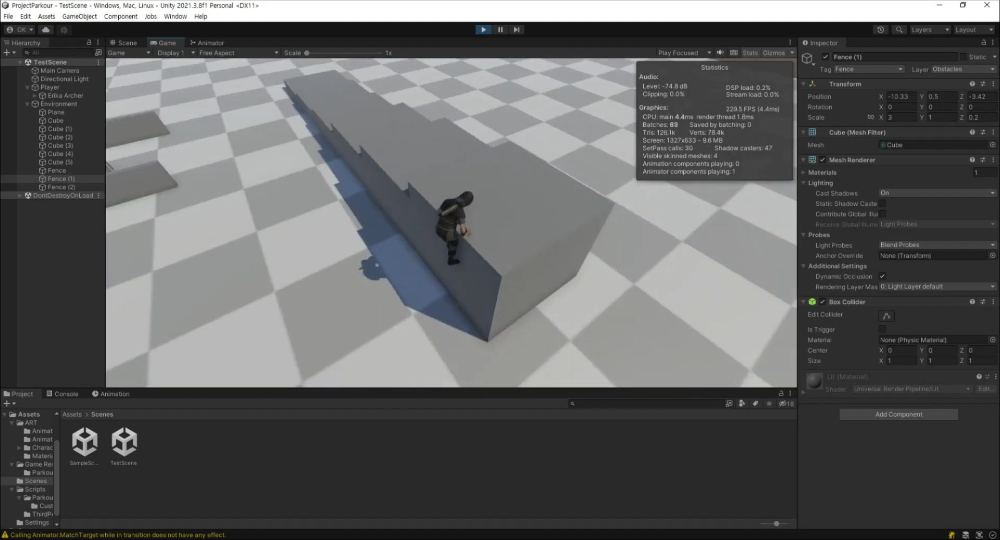

# Unity : TPS Combat

## Character Controller

* Skin Width 값 = Radius 값의 10%를 값으로 할당
* Center Y값 = (Height / 2) + Skin Width 값으로 할당

> Skin Width: 충돌 판정시의 Jittering과 stuck 상태를 줄일 때 사용

## Ground Check

유니티내의 CharacterController의 IsGrounded를 사용 할수 있으나, 종종 다른 판정이 발생하며, 실제 유니티에서 만든 [스타터 에셋](https://assetstore.unity.com/packages/essentials/starter-assets-third-person-character-controller-196526)에서도 직접 체크하고 있는걸 확인 할 수 있다.

`groundCheckRadius값 = Character Controller내의 radius 값이 되도록 신경써야 한다.`

## Resources from

* Mixamo
  * Character
    * PALADIN W/PROP NORDSTROM
  * Animations
    * Breathing Idle
    * Standard Walk
    * Running

## References
* https://assetstore.unity.com/packages/essentials/starter-assets-third-person-character-controller-196526