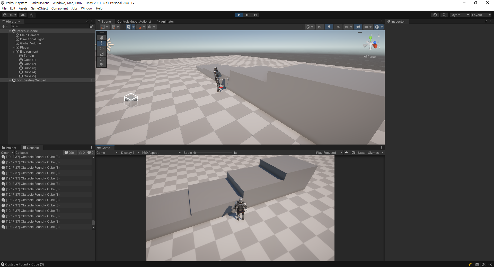

# Unity : TPS Parkour System

## Character Controller
* Skin Width 값 = Radius 값의 10%를 값으로 할당
* Center Y값 = (Height / 2) + Skin Width 값으로 할당

> Skin Width: 충돌 판정시의 Jittering과 stuck 상태를 줄일 때 조절하여 사용

## Ground Check
유니티내의 CharacterController의 IsGrounded를 사용 할수 있으나, 종종 다른 판정이 발생하며, 실제 유니티에서 만든 [스타터 에셋-TPS](https://assetstore.unity.com/packages/essentials/starter-assets-third-person-character-controller-196526)에서도 직접 체크하고 있는걸 확인 할 수 있다.

> groundCheckRadius = Character Controller내의 radius 값이 되도록 유지 필요

## Environment Scanner

다중 RayCast를 사용하여 플레이어 앞의 장애물 및 높이 정보를 확인

## Root motion & Animations CrossFade
애니메이션간의 전환상태에 이상이 생길 수 있기에 비슷한 프레임으로 유지하거나 exit time을 조정해야 한다.

## Target Matching
* EnableTargetMatching : 타겟매칭 애니메이션을 적용할지 말지 선택
* matchBodyPart : 타겟매칭을 적용시킬 부위 선택 (루트-몸통-(왼/오)팔-(왼/오)다리)
* matchStartTime : 타겟 매칭이 시작될 프레임, %로 적용 `(예. 31% 지점 -> 0.31)`
* matchTargetTime : 타겟 매칭이 적용될 프레임, %로 적용 `(예. 51% 지점 -> 0.31)`

## Resources from

* Mixamo
  * Character
    * PALADIN W/PROP NORDSTROM
  * Animations
    * Breathing Idle
    * Standard Walk
    * Running
    * StepUp
    * JumpUp (Running Jump)

## References
* https://assetstore.unity.com/packages/essentials/starter-assets-third-person-character-controller-196526
* https://docs.unity3d.com/ScriptReference/CharacterController-skinWidth.html